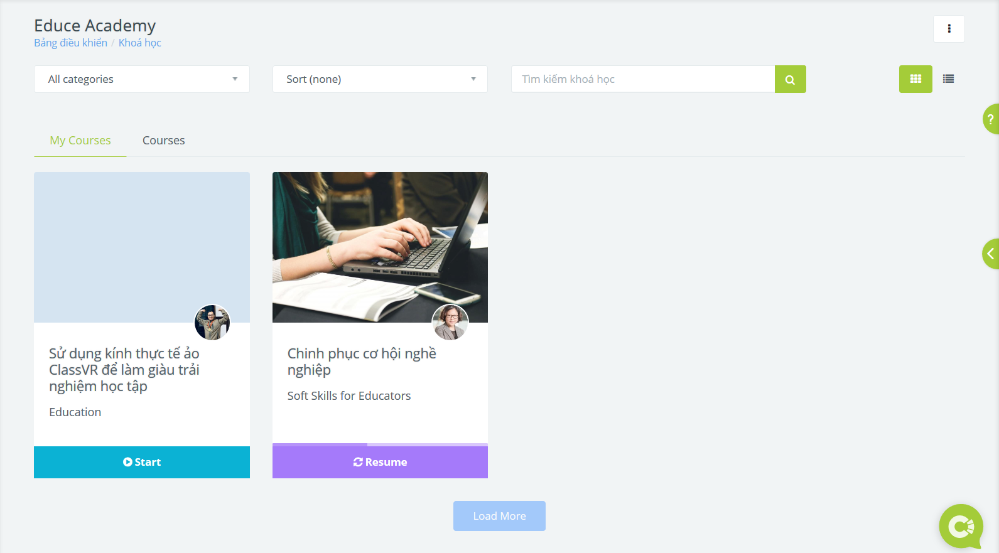
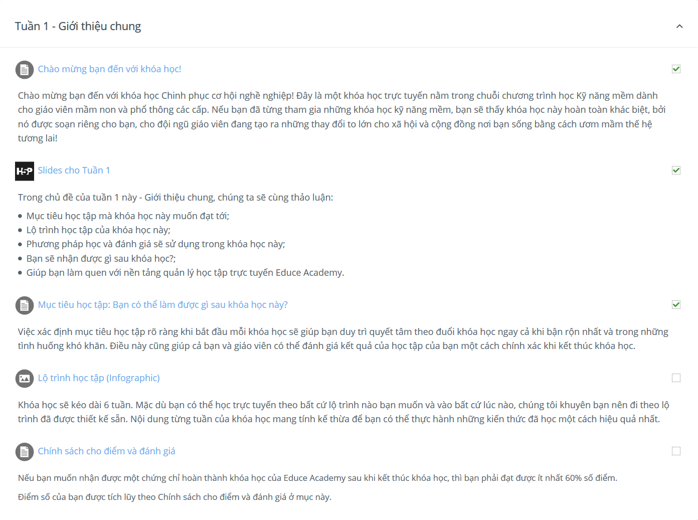
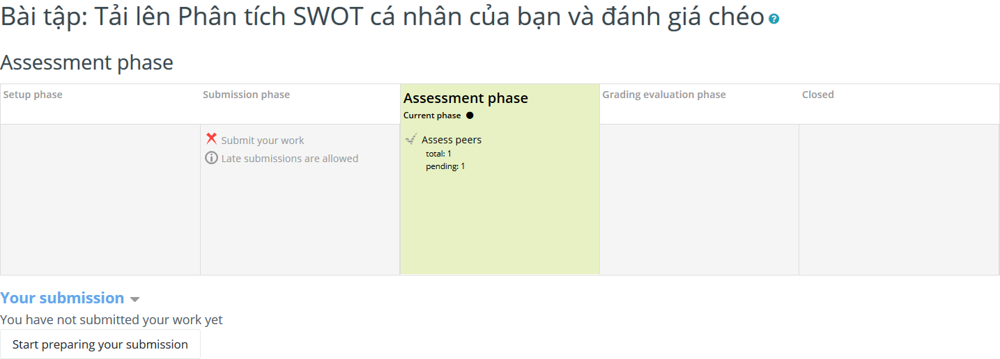
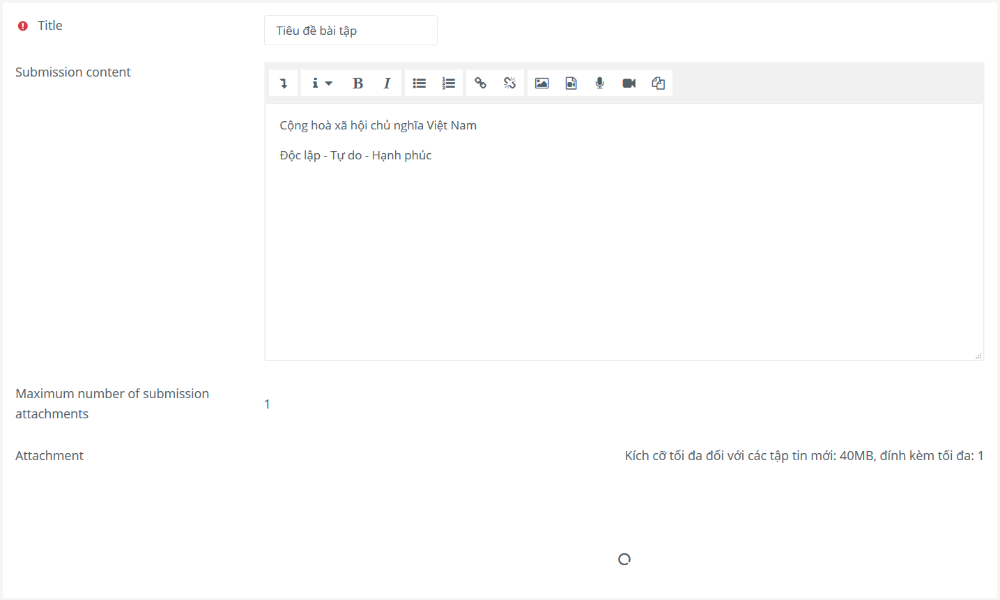
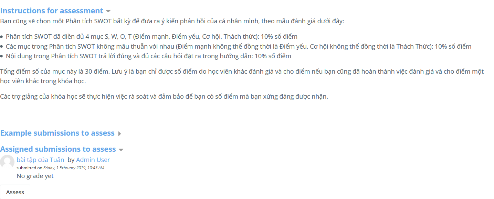
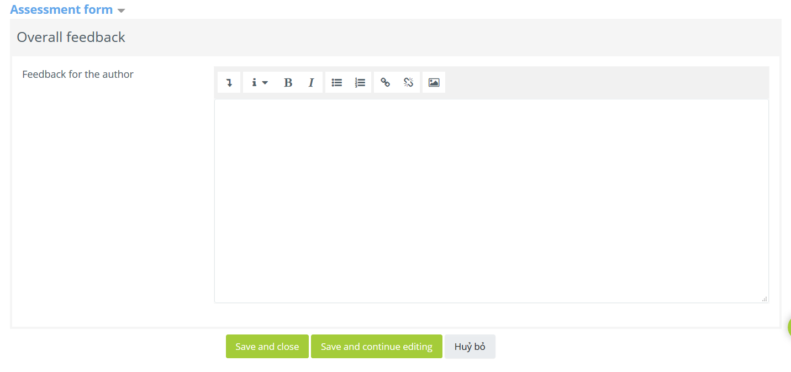

.. _attending:

Hướng dẫn cho học viên
======================

.. contents:: Nội dung
   :local:

Tham gia các khoá học
---------------------

1. Trang *Các khoá học của tôi* liệt kê danh sách các khoá học bạn đang tham gia. Click nút **Start** để bắt đầu khoá học, hoặc **Resume** để tiếp tục khoá học đang tham gia.

2. Sau khi click vào từng khoá học, bạn có thể theo dõi tiến trình tham gia của mình thông qua thanh trạng thái màu xanh trên trang chủ khoá học, hoặc qua các checkbox trong từng hoạt động.

3. Một số hoạt động có thể chứa các slide hoặc bài tập tương tác. Hãy đọc kỹ hướng dẫn đi kèm hoạt động để sử dụng các nội dung này.

Nộp bài
-------

Mỗi hoạt động có thể yêu cầu một định dạng bài tập khác nhau, ví dụ như dạng bài viết hay file tải lên. Để nộp bài tập, click nút **Start preparing your submission** trong hoạt động tương ứng.

Trong trang web nộp bài tập, bạn cần cung cấp tiêu đề bài tập của mình, cũng như những nội dung được yêu cầu. Đọc kỹ phần hướng dẫn gửi bài tập để biết điều kiện gửi bài.

Đánh giá chéo
-------------

Một số hoạt động yêu cầu bạn đánh giá chéo bài tập của các học viên khác. Bạn có thể thấy những bài tập mình cần đánh giá trong mục *Assigned submissions to assess*. Click nút **Assess** để bắt đầu việc đánh giá.

Sau khi đánh giá, dùng form *Your assessment* đi kèm để gửi kết quả đánh giá cho giáo viên.

