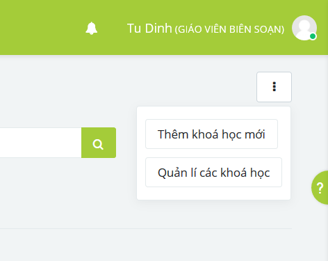
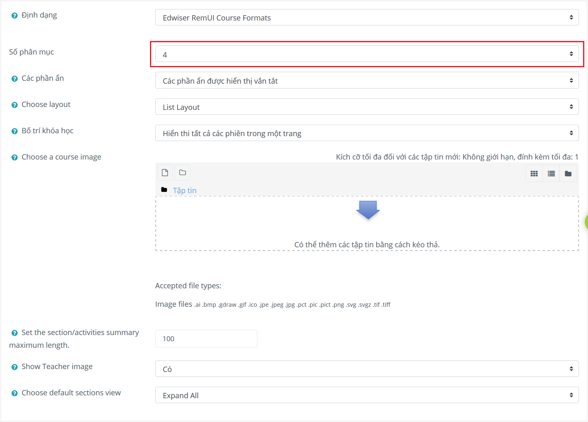

.. _editing:

Soạn thảo khoá học
==================

.. contents:: Nội dung
   :local:

Tạo khoá học
------------

Nếu bạn đã được cấp vai trò biên soạn khoá học, bạn có thể tạo hoặc soạn thảo khoá học bằng nút menu trong trang danh sách khoá học.

Nhập thông tin chung về khoá học (vd. tên, thời gian bắt đầu/kết thúc, mô tả khoá học) trong các mục *Chung* và *Mô tả*. Chỉnh sửa lựa chọn **Số phân mục** trong mục *Định dạng khoá học* để chọn số phân mục cần tạo cho khoá học.

Click **Lưu và cho xem** để hiện khoá học vừa tạo.

Sau khi tạo khoá học, trang *Danh sách thành viên* cho phép bạn thêm các học viên cần tham gia khoá học. Tham khảo :ref:`teaching-enrolling` để biết thêm chi tiết về việc đăng ký môn học cho các học viên.

Soạn thảo nội dung
------------------
