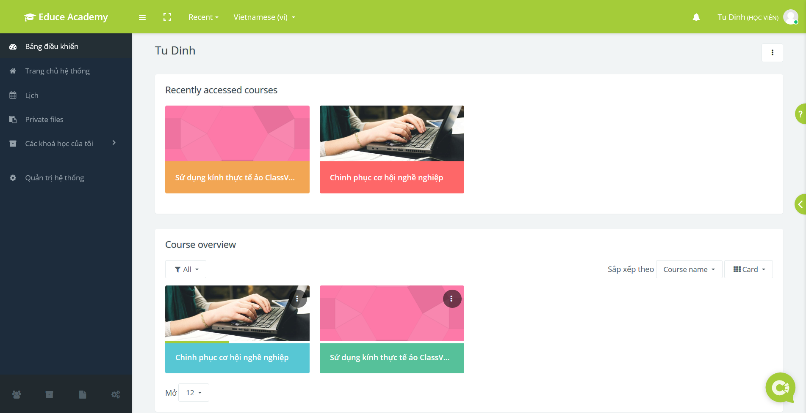
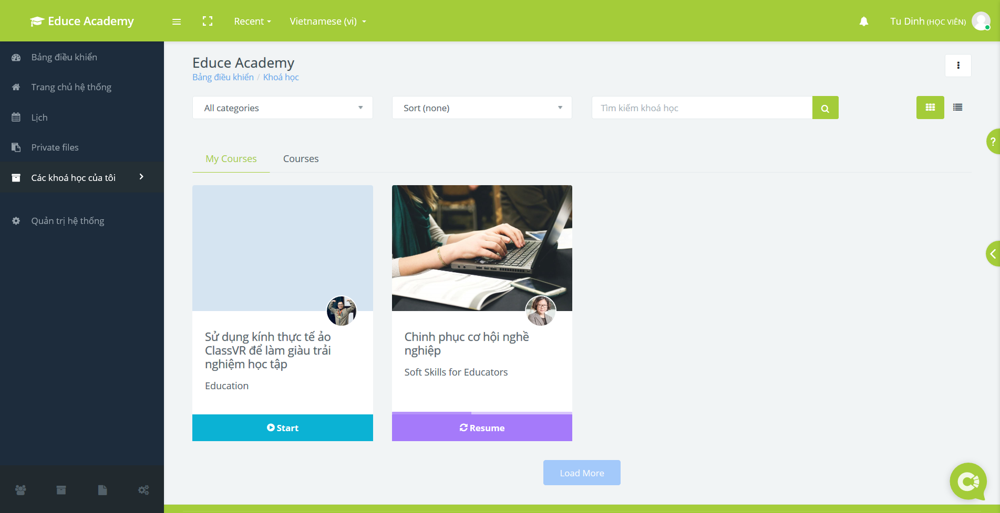

.. _mie:

Hướng dẫn tham gia khoá General English for MIE Students
========================================================

.. contents:: Nội dung
   :local:

Đăng nhập Educe Academy
-----------------------

Để bắt đầu sử dụng Educe Academy, bạn chỉ cần thực hiện những bước đơn giản sau.

1. Truy cập trang web của |educe_academy|.

.. |educe_academy| raw:: html

   <a href="https://educe.academy/portal/" target="_blank">Educe Academy</a>

2. Đăng nhập tài khoản Educe Academy. Bạn có thể sử dụng tài khoản sẵn có, hoặc đăng nhập bằng Google và Microsoft.

3. Trang *Bảng điều khiển* thể hiện danh sách các khoá học bạn đang tham gia.

4. Bạn cũng có thể truy cập danh sách các khoá học hiện tại trong trang *Các khoá học của tôi*.

5. Trong quá trình tham gia khoá học, nếu bạn có thắc mắc về cách sử dụng trang web, bạn có thể sử dụng nút Trợ giúp bên cạnh.

6. Khi có những thắc mắc về kỹ thuật hay về trang web Educe Academy, bạn có thể trò chuyện trực tiếp với chúng tôi qua hệ thống live chat.

Chúc bạn có một trải nghiệm học tập hứng thú và hiệu quả!

Truy cập khoá học
-----------------

Để vào được khoá học, hãy đăng nhập vào Educe Academy và truy cập khoá học theo link sau:

|mie_course|

.. |mie_course| raw:: html

   <a href="https://educe.academy/portal/course/view.php?id=15" target="_blank">General English for MIE Students</a>

Sau khi vào trang web của khoá học, hãy bắt đầu học bằng cách click vào đường link **Enrol me**:

.. image:: mie/enrol.png

Hướng dẫn người học
-------------------

Để biết thêm thông tin về khoá học, vui lòng truy cập tài liệu |learners_guide|.

.. |learners_guide| raw:: html

   <a href="https://educe.academy/portal/mod/page/view.php?id=370" target="_blank">Hướng dẫn người học</a>
