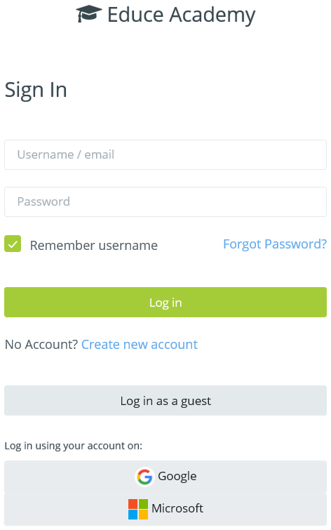
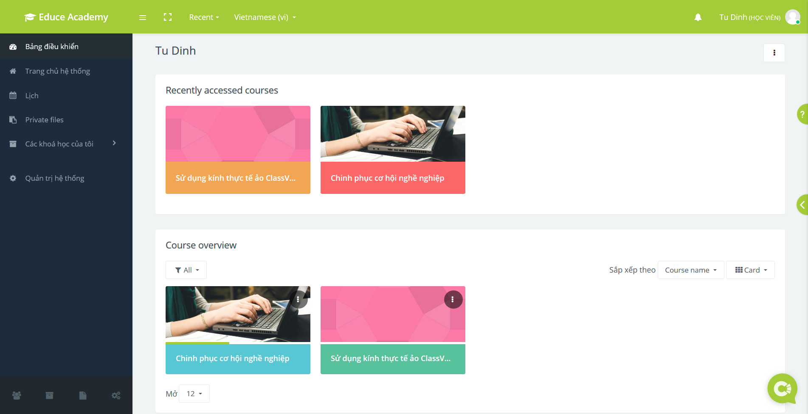
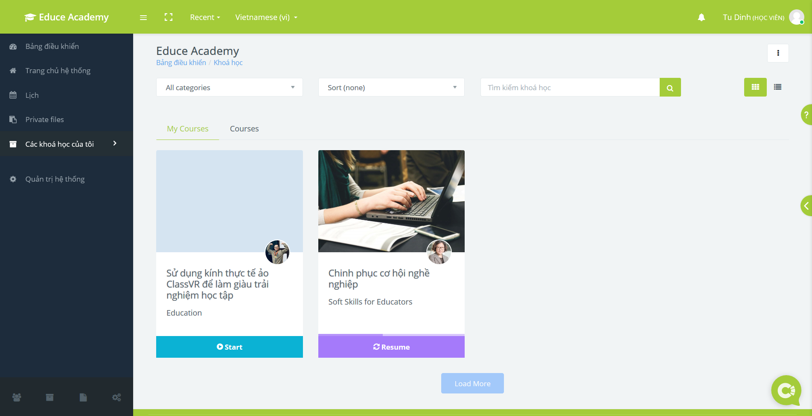

.. _quickstart:

Hướng dẫn bắt đầu nhanh
=======================

Để bắt đầu sử dụng Educe Academy, bạn chỉ cần thực hiện những bước đơn giản sau.

1. Truy cập trang web của `Educe Academy <https://educe.academy/portal/>`_;
2. Đăng nhập tài khoản Educe Academy. Bạn có thể sử dụng tài khoản sẵn có, hoặc đăng nhập bằng Google và Facebook;

3. Trang *Bảng điều khiển* thể hiện danh sách các khoá học bạn đang tham gia.

4. Bạn cũng có thể truy cập danh sách các khoá học hiện tại trong trang *Các khoá học của tôi*.

5. Tận hưởng các khoá học phong phú của Educe Academy.
