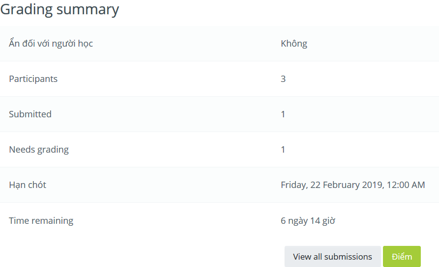
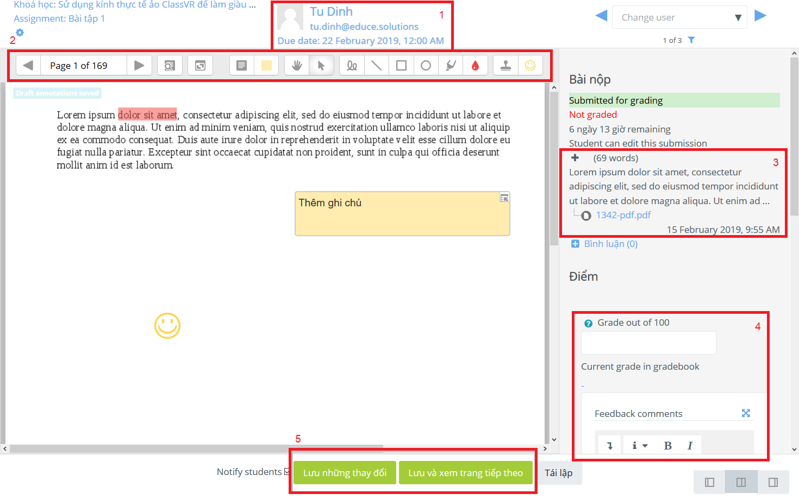

.. _teaching:

Hướng dẫn cho giáo viên
=======================

.. contents:: Nội dung
   :local:

.. _teaching-enrolling:

Đăng ký môn học
---------------

Để đăng ký môn học cho các học viên, bạn có thể làm theo các bước sau.

1. Trong menu của khoá học, chọn mục **More**.

.. image:: teaching/more.png

2. Trong tab *Thành viên*, chọn **Người dùng đã ghi danh**.

.. image:: teaching/users.png

3. Click nút **Enrol users** để bắt đầu đăng ký môn học.

.. image:: teaching/enroll.png

4. Trong trang *Enrol users*, chọn danh sách học viên cần đăng ký và click **Enrol users** để hoàn tất đăng ký.

.. image:: teaching/enroll-page.png

Chấm bài
--------

Bạn có thể thấy danh sách bài tập bằng cách click vào mỗi phần nội dung môn học. Các mục *Participants*, *Submitted* và *Needs grading* tương ứng thể hiện số học viên tham gia, số bài tập đã nhận và số bài tập chưa chấm điểm. Click nút **View all submissions** để thấy danh sách tất cả bài tập đã nộp, hoặc **Điểm** để bắt đầu việc chấm điểm.

Giao diện chấm điểm có hình thức như sau:

1. Tên người gửi bài;
2. Các công cụ chấm điểm;
3. Nội dung bài tập, bao gồm các file đính kèm;
4. Phần chấm điểm và đánh giá của giáo viên;
5. Lưu điểm của bài.

Sử dụng các nút **◀** và **▶** để chuyển giữa các trang của bài tập. Bạn có thể sử dụng các công cụ trong phần 2 để thêm ghi chú cũng như đánh dấu vào bài tập. Sau khi hoàn tất đánh giá, sử dụng nút **Lưu những thay đổi** để lưu đánh giá, hoặc **Lưu và xem trang tiếp theo** để đánh giá bài tập khác.
