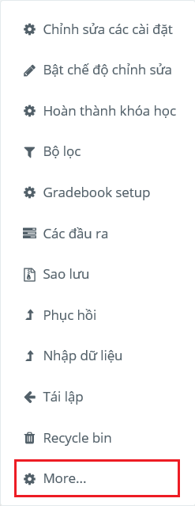
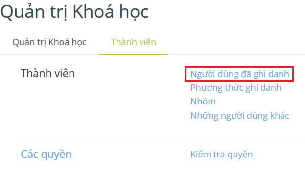
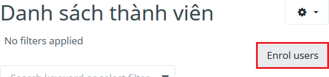
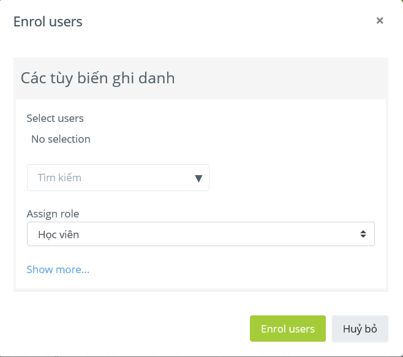

.. _teaching:

Hướng dẫn cho giáo viên
=======================

.. contents:: Nội dung
   :local:

Đăng ký môn học
---------------

Để đăng ký môn học cho các học viên, bạn có thể làm theo các bước sau.

1. Trong menu của khoá học, chọn mục **More**.

2. Trong tab *Thành viên*, chọn *Người dùng đã ghi danh*.

3. Click nút **Enrol users** để bắt đầu đăng ký môn học.

4. Trong trang *Enrol users*, chọn danh sách học viên cần đăng ký và click **Enrol users** để hoàn tất đăng ký.

Chấm bài
--------
